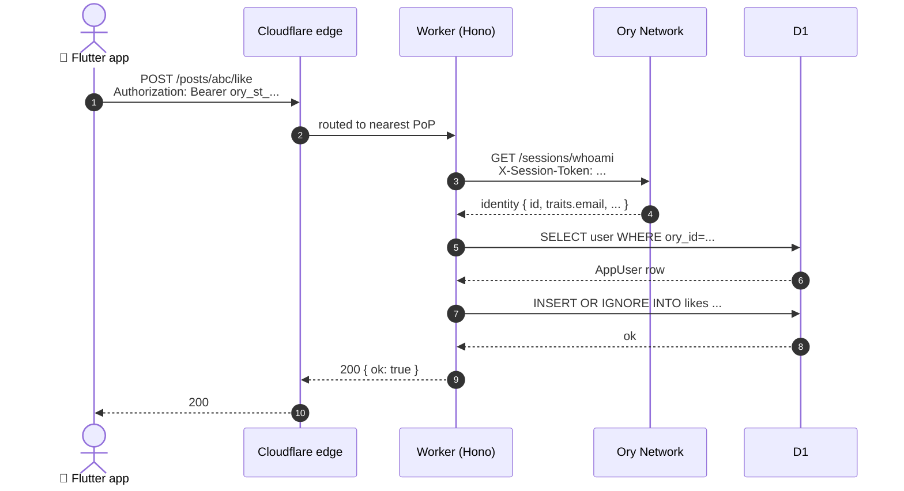
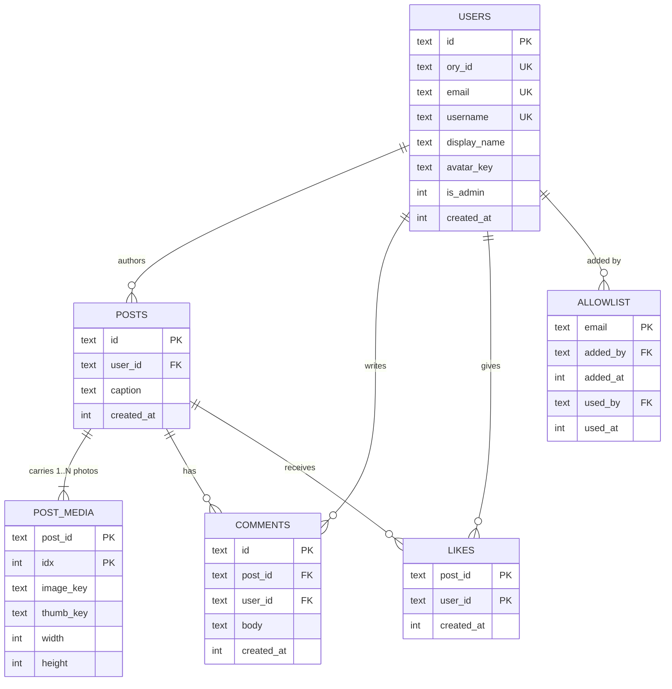

# Architecture

How Familygram is put together, why these pieces were chosen, and how a request flows from a phone tap to a row in D1.

---

## System overview



> Diagram source: `docs/images/architecture.mmd` (Mermaid `architecture-beta`). Regenerate with `make arch-diagram` — runs the Mermaid CLI with iconify's `logos` + `simple-icons` packs so each vendor logo embeds as inline SVG. We commit the rendered file so it works in every Markdown viewer (GitHub doesn't auto-register Mermaid icon packs).

**What's flowing where**:

- **Sign-in (OIDC)**: the iOS app talks to Ory directly via a native `session_token_exchange_code` flow. Ory hosts the OAuth dance with either Google or Apple (selected by the user on the login screen). The app opens an in-app Safari sheet, the user authenticates with the chosen provider, the provider sends an auth grant to Ory, Ory hands back an opaque `session_token` via the `familygram://callback` URL. One-time per session.
- **API requests**: every authenticated call goes from the app to the Worker as `Authorization: Bearer <session_token>`. The token lives in iOS Keychain (via `flutter_secure_storage`).
- **Token verification**: on each request the Worker calls Ory's `/sessions/whoami` to validate the bearer. Future optimization: switch to a JWT tokenizer template + local JWKS verification to drop the hop — see [ORY_SETUP.md §7](ORY_SETUP.md#7-performance-upgrade-optional-later).
- **Data + media**: the Worker reads/writes D1 (SQLite at the edge) via binding for users/posts/likes/comments, and reads/writes R2 (S3-compatible blob store) for image bytes. No origin server, no managed connection pool — both are accessed as edge-bound services.

Everything inside the Cloudflare box is on the free tier — see the [pricing section in README](../README.md#pricing).

---

## Request lifecycle (an authenticated API call)

What actually happens when the user taps **Like** on a post:



Three things to notice:

1. **TLS termination + DDoS** happens at the edge before the request even reaches our code. Cloudflare's global anycast network routes the user's request to the nearest point of presence, decrypts it, screens it, and forwards to the Worker.
2. **The Worker runs at the edge too** — typically the same region as the user. D1 reads are routed to the database's home region; R2 is globally distributed.
3. **No origin server.** There's no traditional VM, no autoscaling group. The Worker is a function; if no one's using it, it costs nothing and runs nowhere.

---

## Why these tech choices

| Choice | Why                                                                                                                | Alternatives considered                                          |
|--------|--------------------------------------------------------------------------------------------------------------------|------------------------------------------------------------------|
| Cloudflare Workers | Edge runtime, single-binding access to D1/R2/Queues, free tier covers thousands of family-day requests.       | AWS Lambda + RDS + S3 (no free tier, more ops); Fly.io (paid).   |
| Hono | Tiny (~12 KB), web-standards routing, type-safe context, very nice middleware story.                                  | Express (heavy, not edge-native); itty-router (smaller but less ergonomic). |
| Cloudflare D1 | SQLite via binding — no connection pool to manage, no server to keep alive, 5 GB free.                          | KV (key-value, not relational); Postgres on Neon (cold-start + connection limits). |
| Cloudflare R2 | S3-compatible, **no egress fees**. Photos served from your own domain.                                            | AWS S3 (egress costs hurt at scale); Cloudinary (paid).         |
| Ory Network | Hosted Kratos. Free for thousands of MAUs. Built-in Google OIDC.                                                   | Auth0 (paid above free tier); rolling your own JWT (don't).      |
| Flutter (iOS-first) | Single codebase reaches Android + web later. Native enough for camera/biometrics.                          | Swift-native (lock-in to Apple); React Native (worse photo libraries). |
| Local Face ID (`local_auth`) | Server-side passkey adds login complexity; local unlock is the right tool for "lock the app, not the auth." | Ory WebAuthn passkeys (deferred — see "Why" doc).            |

---

## Data model



A `POSTS` row carries metadata (author, caption, time); the photos themselves live in `POST_MEDIA`, one row per photo, ordered by `idx` from 0. A single-photo post is just one `POST_MEDIA` row; a carousel is multiple. The Worker enforces a hard cap (`MAX_POST_MEDIA`, default 5) on the photo count per post — change the var in `backend/wrangler.jsonc` and redeploy to lift it. The mobile picker reads the same number off `GET /config` so client and server stay aligned.

**Backward-compat shim**: `decoratePost` in `backend/src/index.ts` mirrors `media[0]`'s `image_url` / `thumb_url` / `width` / `height` as top-level fields on the post JSON. Mobile builds shipped before the multi-photo migration read those top-level keys; the shim keeps them working (showing only the first photo) until every install in the wild has updated. Safe to delete the four `first?.*` lines and the comment above them once that's true.

Migrations live in `backend/migrations/`. Run them with `make worker-migrate` (local) or `make worker-migrate-prod` (production).

---

## Storage layout in R2

- `posts/<user_id>/<post_id>_<idx>.<ext>`        — full image at `idx` in the carousel, 2000 px max edge, WebP q82 (older single-photo posts from before the multi-photo migration use the legacy `posts/<user_id>/<post_id>.jpg` shape; either key is fine, we read whatever `post_media.image_key` says).
- `posts/<user_id>/<post_id>_<idx>_thumb.<ext>` — display tier, 1200 px max edge, WebP q80. Served on the feed and in the comments sheet.
- `avatars/<user_id>/<version>.jpg`             — square 256 px avatar; version suffix busts client caches across uploads.

`<idx>` is 0-based and matches the `POST_MEDIA.idx` column, so the carousel order in the UI follows the order on disk.

## Signed media URLs

All R2 reads go through the Worker, gated by an HMAC-SHA256 signature with a 1-hour TTL:

```
GET /media/<scope>/<owner>/<filename>?e=<unix-expiry>&s=<base64url(HMAC)>
```

The Worker signs URLs in the response payloads (feed, post, comments, user) using a `MEDIA_SIGNING_SECRET` Worker secret. The `/media/...` route verifies signature + expiry before fetching from R2. Leaked URLs stop working when they expire.

Client side, `cached_network_image` is configured with a stable `cacheKey` (the post id + tier) so URL rotation across hours doesn't trigger re-download — the disk cache hits even with a fresh URL.

---

## Where this could go next

- **JWT tokenizer template** in Ory → drop the per-request whoami hop (saves ~50–100 ms / request).
- **Passkey re-auth** alongside Google sign-in → faster session refresh.
- **FCM push** for new-post and @mention notifications (requires paid Apple Dev).
- **Cloudflare Queues** for fan-out (e.g., notify all family members when a post is created).
- **Cloudflare Stream** when video lands (paid, but native HLS + transcoding worth it).
